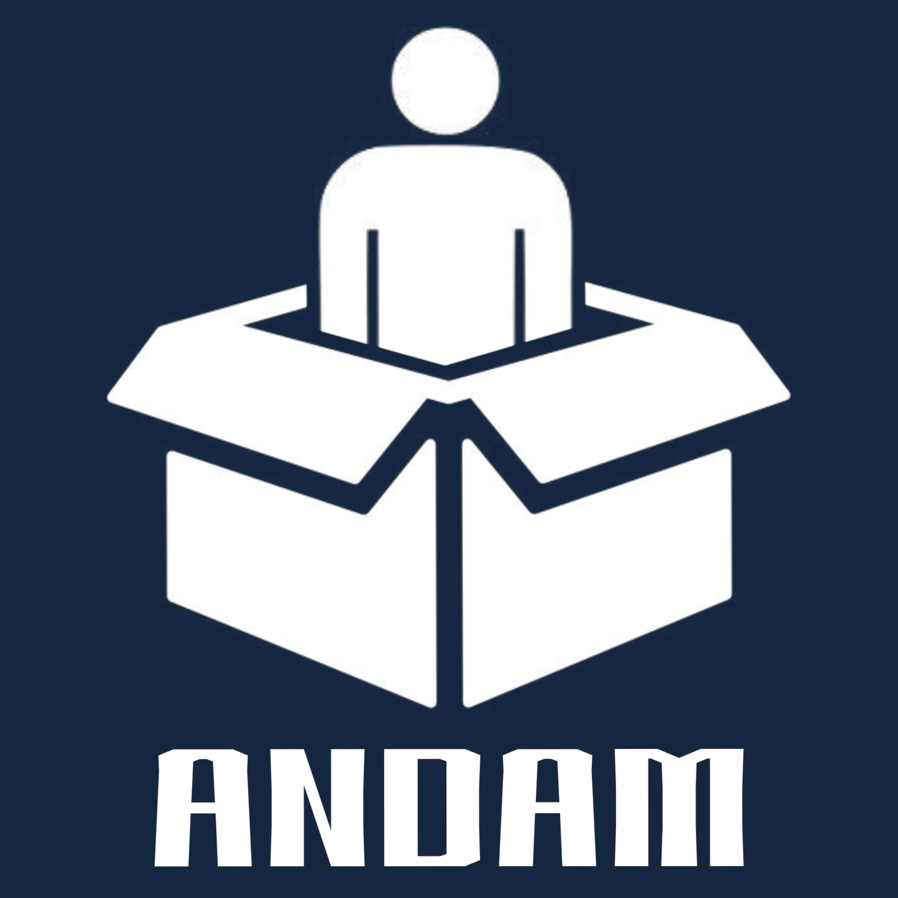
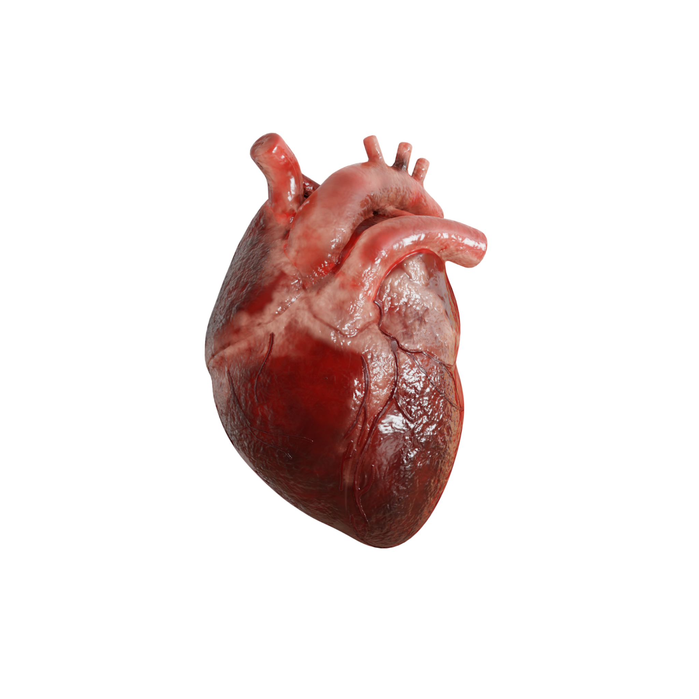
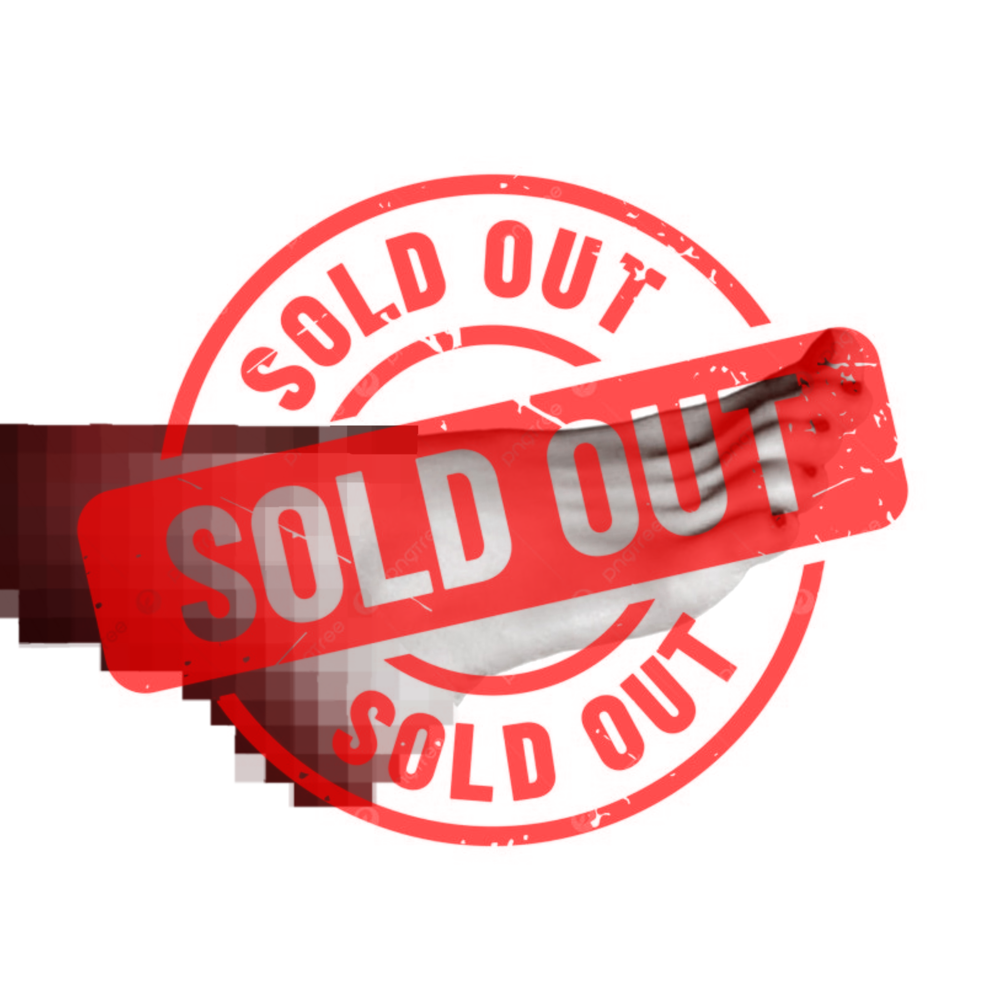
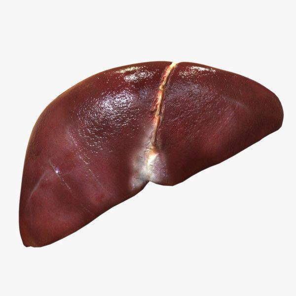

# http-Andamshop.github.io
<!DOCTYPE html>
<html lang="fa">
<head>

    <meta charset="UTF-8">

    <meta name="viewport" content="width=device-width, initial-scale=1.0">

    <title>Totally Normal Store</title>

    <!-- Modern Fonts -->
    <link rel="preconnect" href="https://fonts.googleapis.com">
    <link rel="preconnect" href="https://fonts.gstatic.com" crossorigin>

    <link href="https://fonts.googleapis.com/css2?family=Inter:wght@400;500;600;700&family=Playfair+Display:wght@500;600;700&display=swap"
          rel="stylesheet">

    

</head>

<body>

    <!-- =========================
         HEADER
    ========================== -->

    <header>

        

        <nav>

            <a href="#"
               onclick="showMessage('به صفحه اصلی خوش آمدید.')">
                Home
            </a>

            <a href="#products"
               onclick="showMessage('چیزی برای دیدن نیست. همین‌ها هستند.')">
                Products
            </a>

            <a href="#"
               onclick="showMessage('اطلاعاتی درباره ما وجود ندارد.')">
                About
            </a>

            <a href="#"
               onclick="showMessage('لطفاً مزاحم نشوید.')">
                Contact
            </a>

            <!-- SEARCH -->

            <button
                class="search-button"
                onclick="showMessage('🔍 توی بدن خودت دنبالش بگرد، اینجا چیزی نیست.')"
                aria-label="Search">

                

            </button>

        </nav>

    </header>

    <!-- =========================
         HERO
    ========================== -->

    <section class="hero">

        

            

                WELCOME TO
            

            <h1>
                Totally Normal Store
            </h1>

            

                Everything you need. Probably.
            

        

    </section>

    <!-- =========================
         PRODUCTS
    ========================== -->

    <section class="products-section" id="products">

        

            <small>
                OUR PRODUCTS
            </small>

            <h2>
                Some Totally Normal Stuff
            </h2>

            

                Quality products for absolutely no reason.
            

        

        

            <!-- PRODUCT 1 -->

            

                

                    

                    
                        SOLD OUT
                    

                

                

                    <h3 class="product-title">
                        brain with average IQ
                    </h3>

                    

                        A completely normal product.
                    

                    

                        29,900 $
                    

                    <button
                        class="buy-button sold-button"
                        onclick="showMessage('این محصول فروخته شده. حتی خودمون هم نمی‌دونیم به کی.')">

                        SOLD OUT

                    </button>

                

            

            <!-- PRODUCT 2 -->

            

                

                    

                

                

                    <h3 class="product-title">
                        heart for your lover
                    </h3>

                    

                        give her a real heart.
                    

                    

                        39,900 $
                    

                    <button
                        class="buy-button"
                        onclick="showMessage('به‌عنوان یه مدافع حقوق حیوانات، همچین کار غیرانسانی‌ای رو نمی‌ذارم بکنی. 🐦‍⬛‼️❌')">

                        خرید

                    </button>

                

            

            <!-- PRODUCT 3 -->

            

                

                    

                    
                        SOLD OUT
                    

                

                

                    <h3 class="product-title">
                        too rude to say
                    </h3>

                    

                        why is it so popular?
                    

                    

                        49,900 $
                    

                    <button
                        class="buy-button sold-button"
                        onclick="showMessage('این یکی هم فروخته شده. واقعاً سریع خرید می‌کنید.')">

                        SOLD OUT

                    </button>

                

            

            <!-- PRODUCT 4 -->

            

                

                    

                

                

                    <h3 class="product-title">
                        perfect for alcoholics.
                    </h3>

                    

                        Nobody knows what this does.
                    

                    

                        59,900 $
                    

                    <button
                        class="buy-button"
                        onclick="showMessage('به‌عنوان یه مدافع حقوق حیوانات، همچین کار غیرانسانی‌ای رو نمی‌ذارم بکنی. 🐦‍⬛‼️❌')">

                        خرید

                    </button>

                

            

            <!-- PRODUCT 5 -->

            

                

                    

                

                

                    <h3 class="product-title">
                        I promise you that's healthy.
                    </h3>

                    

                        If you keep smoking:
                    

                    

                        69,900 $
                    

                    <button
                        class="buy-button"
                        onclick="showMessage('به‌عنوان یه مدافع حقوق حیوانات، همچین کار غیرانسانی‌ای رو نمی‌ذارم بکنی. 🐦‍⬛‼️❌')">

                        خرید

                    </button>

                

            

            <!-- PRODUCT 6 -->

            

                

                    

                

                

                    <h3 class="product-title">
                        Brown eye.
                    </h3>

                    

                        We think it's useful.
                    

                    

                        7,900 $
                    

                    <button
                        class="buy-button"
                        onclick="showMessage('به‌عنوان یه مدافع حقوق حیوانات، همچین کار غیرانسانی‌ای رو نمی‌ذارم بکنی. 🐦‍⬛‼️❌')">

                        خرید

                    </button>

                

            

            <!-- PRODUCT 7 -->

            

                

                    

                

                

                    <h3 class="product-title">
                        2 of them.
                    </h3>

                    

                        Nobody asked for this.
                    

                    

                        89,900 $
                    

                    <button
                        class="buy-button"
                        onclick="showMessage('به‌عنوان یه مدافع حقوق حیوانات، همچین کار غیرانسانی‌ای رو نمی‌ذارم بکنی. 🐦‍⬛‼️❌')">

                        خرید

                    </button>

                

            

        
